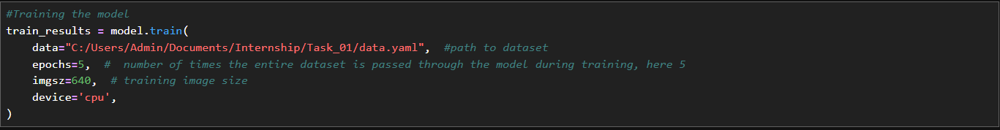
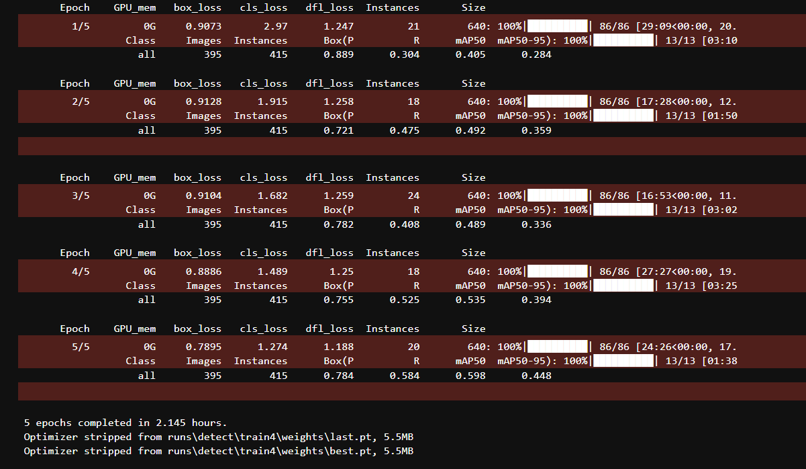
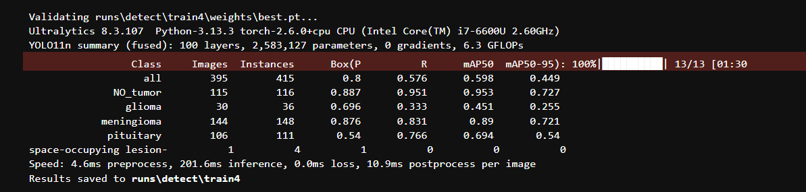
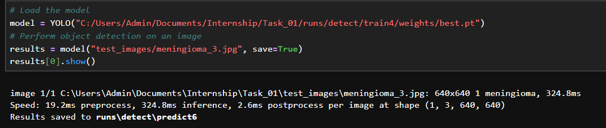
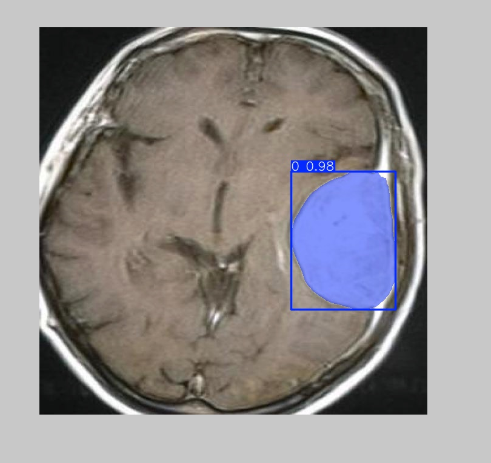
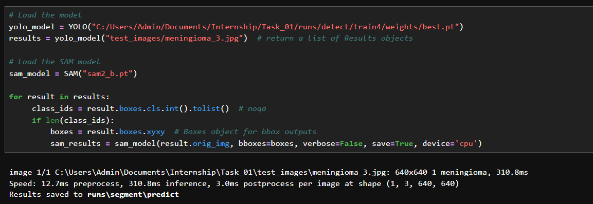
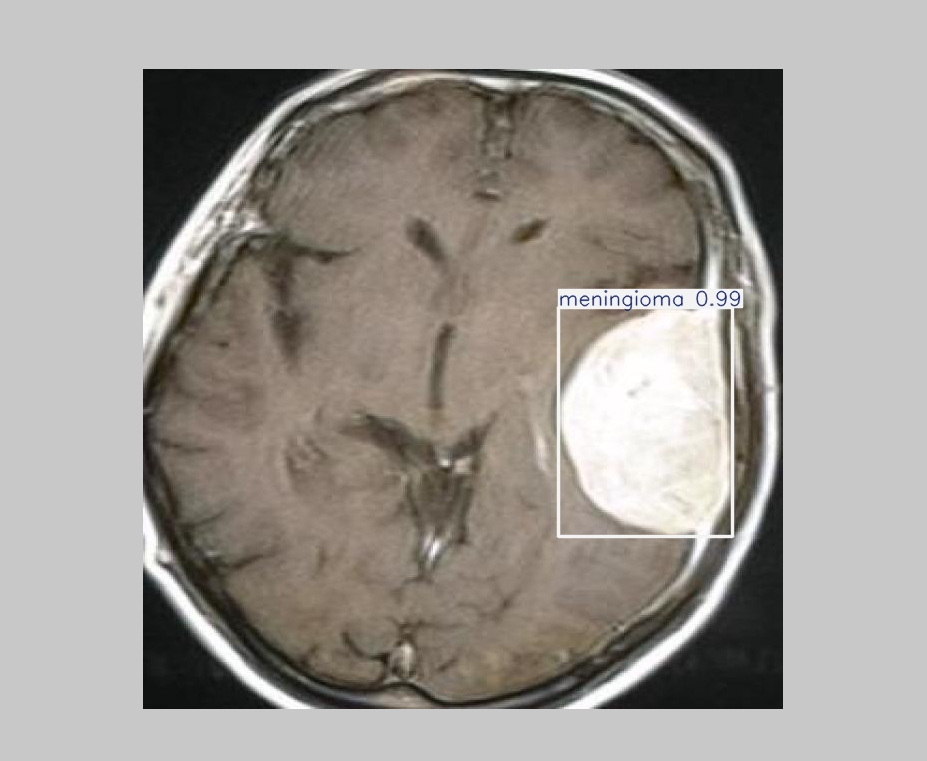

# Brain Tumor Segmentation Using YOLOv11 and SAM2

## Project Description
This project focuses on using advanced computer vision models, **YOLOv11** and **SAM2**, to segment brain tumors in medical images for improved diagnosis and treatment planning.

## Technologies Used
- **YOLOv11**: Real-time object detection model for identifying multiple objects.
- **SAM2**: Model for precise segmentation of objects.
- **Python**, **OpenCV**, **TensorFlow**, **PyTorch**.

## Training the Model
I trained the **YOLOv11** model using my dataset for 5 epochs on a CPU. Each epoch involves the model seeing the whole dataset once. Here's a breakdown of the training:

 

### Epoch 1
The model started training, initially with lower accuracy and higher loss, but began learning object locations and classes.

### Epoch 2-4
As training progressed, the model improved, with losses decreasing and predictions becoming more accurate.

### Epoch 5
By the end of training, the model reached better accuracy, improving its performance in detecting and classifying brain tumors.

Due to hardware limitations, I used only 5 epochs, and the training took approximately 2.5 hours on the CPU.

 

## Model Validation
After training, I validated the model on the test set.

### Model: YOLOv11, 100 layers, running on CPU.

### Performance:
Precision (P), Recall (R), and mAP50 show the model’s accuracy in detecting and classifying tumors.

- Best performance for No Tumor images (mAP50 = 0.953).
- Moderate performance for Meningioma (mAP50 = 0.89) and Pituitary Tumor (mAP50 = 0.694).
- Poor performance for Space-Occupying Lesions (mAP50 = 0).

### Speed:
- Average 4.6ms preprocessing, 201.6ms inference per image.

Results are saved in the `runs/detect/train4` directory.

 

## Applying YOLOv11 for Object Detection
To begin with, I loaded the **YOLOv11** model, which was trained earlier for detecting various brain tumor types. The **YOLOv11** model is responsible for detecting objects in the image (in this case, tumors) and providing bounding boxes around them. This helps in localizing the tumors for further analysis.

## Applying YOLOv11 for Object Detection
The **YOLOv11** model is used for detecting objects in an image (such as tumors) and providing bounding boxes to localize them. I applied this model to detect a **Meningioma** tumor in a test image, which allowed me to localize the tumor for further analysis.

### Object Detection Results:
The **YOLOv11** model detected a **Meningioma** tumor in the provided test image. The image was resized to 640x640 for processing, and the detection process took about 310.8ms.

- **Speed**: 
  - 12.7ms for preprocessing
  - 310.8ms for inference (actual detection)
  - 3.0ms for postprocessing

The results, including bounding boxes around the detected object, were saved in the directory `runs/detect/predict`.

## Applying SAM2 for Precise Segmentation
The **SAM2** model is used for precise segmentation of detected objects. After **YOLOv11** detected the **Meningioma** tumor and provided the bounding box coordinates, I applied the **SAM2** model to segment the tumor with high accuracy, highlighting the exact tumor region for further diagnosis and treatment planning.

### SAM2 Segmentation Results:
The **SAM2** model takes the bounding boxes outputted by **YOLOv11** and applies precise segmentation to highlight the exact tumor region. This ensures that the tumor is accurately delineated from the surrounding tissue, which is crucial for effective diagnosis and treatment planning.

The segmented results were saved in the directory `runs/segment/predict`, where each segmented region corresponds to a tumor detected by the YOLOv11 model.

